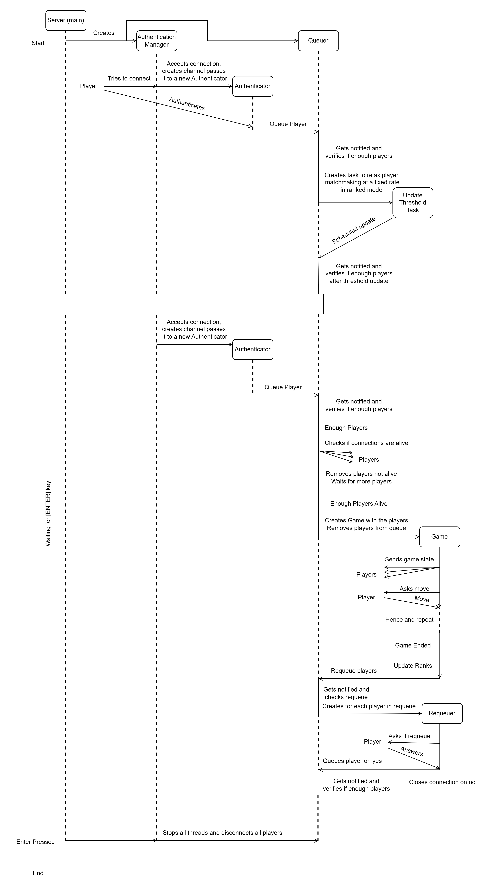
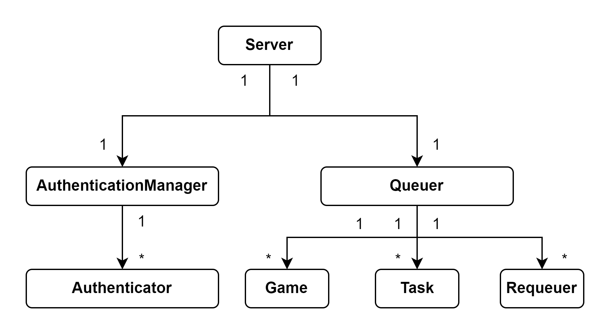

# Assignment 2 - Poker Game
## Group members:

1. João Ramos (up202108743@edu.fe.up.pt)
2. Marco Costa (up202108821@edu.fe.up.pt)
3. Tiago Viana (up201807126@edu.fe.up.pt)

## Notes
This project was developed using Java SE 21 and Gradle 8.5.
The list of dependencies used are the following:
- [JDBC](https://docs.oracle.com/javase/8/docs/technotes/guides/jdbc/)
- [jBCrypt](https://www.mindrot.org/projects/jBCrypt/)
- [JSON](https://github.com/stleary/JSON-java)
- [GSON](https://javadoc.io/doc/com.google.code.gson/gson/latest/com.google.gson/com/google/gson/Gson.html)

## Run Server

```bash
$ gradle server --args="<port> [-l] [-r]"
```

- \<port\> must be a valid port, ex: 8000
- [-l] is optional and enables logging
- [-r] is optional and enables ranked mode

## Run Client

```bash
$ gradle client --args="<host> <port>"
```

- \<host\> must be a valid host, ex: localhost
- \<port\> must be a valid port, ex: 8000

## Database

The database is stored in the `database` folder inside the project `src` folder. We are using a SQLite database.

In order to reset and populate the database with the initial data, run the following command:

```bash
$ gradle databaseInit
```

The database contains only one table, `users`, capable of storing the following fields:
- username (PK)
- password
- rank
- session_token
- session_expiration

For the purpose of this project, the database is pre-populated with the following users:

| username | password (on login) | rank   |
|----------|----------|--------|
| marco    | marco    | 1000   |
| tiago    | tiago    | 2000   |
| ramos    | ramos    | 1000   |
| joao     | joao     | 1500   |
| rita     | rita     | 500    |
| jorge    | jorge    | -10000 |
| afonso   | afonso   | 5000   |
| camilla  | camilla  | 5000   |
| baquero  | baquero  | 0      |
| alberto  | alberto  | 0      |
| veronica | veronica | 0      |

The passwords are stored using BCrypt hash with *salt*.

A new token is generated using BCrypt hash with *salt* and the username when the user authenticates, and it is stored in the database. This token is valid for 24 hours.

The token can be used to reconnect to the server without the need to authenticate again.

## Communication

The communication between the server and the client is done using a custom message protocol and channels.
Most of the classes implemented for this purpose are within the `poker.connection.protocol` package.

The communication can be divided into two main parts:
- **Messages**
- **Channels**

### Messages

Messages are the objects that are sent between the server and the client. They contain 4 important fields:
- **State**: represents the stage of the application in which the message is being sent (e.g. CONNECTION_END, AUTHENTICATION, MATCH_RECONNECT, etc.)
- **Status**: represents the status of the message (REQUEST, OK, ERROR)
- **Body**: a string that contains direct feedback about the message, usually provided by the server (e.g. *"User successfully logged in"*, etc.).
- **Data**: contains differnt attributes that are specific to the message being sent (e.g. username and password, etc.)

This messages are being sent using the JSON format. The GSON library is used for the serialization and deserialization of more complex objects.

### Channels

The channels are objects of the abstract class `Channel`. 
This class is extended by two other classes:
- **ClientChannel**: represents the channel that is used by the client to communicate with the server.
- **ServerChannel**: represents the channel that is used by the server to communicate with the client.

The channel stores the Socket and the associated Input and Output streams, and creates a new layer of abstraction for the communication between both parties.

### Channel Exceptions

During the communication, many different types of errors can occur and for a multitude of reasons. In order to classify these errors many types of exceptions were defined within the `poker.connection.protocol.exceptions` package.
These exceptions are thrown when an error occurs and are caught by the server or the client, depending on the context. They include:
- **ClosedConnectionException**: thrown when the channel is closed.
- **RequestTimeoutException**: thrown when a request times out.
- **TokenMismatchException**: thrown when one of the parties does not recognize the received token.
- **UnexpectedMessageException**: thrown when an unexpected message is received, depending on both the state and the status of the message.

## Game

The game implemented is a simple version of "Poker Texas Hold'em". The game is played between 6 players, the server being the dealer.

The most of the game logic and model is implemented in the `game` directory.

The number of players is easily configurable by changing the value of the constant `NUM_PLAYERS` in the `poker.game.common.PokerConstants.java` class.

For easier manipulation of the game by the server, the main class `Poker` represents the current game instance state.

## Architecture


Figure 1 - Simple flow of the program (Reconnections not depicted)

As depicted in Figure 1, there are 3 main threads running in the server application:
- **Server**: responsible for starting the other threads and closing the server.
- **AuthenticationManager**: responsible for accepting new connections and authenticating users.
- **Queuer**: responsible for managing the queue of players waiting to play and starting games.

This structure allowed for a more organized and efficient way of managing the server application.

The **AuthenticationManager** creates another thread **Authenticator** for each new connection, which is responsible for handling the authentication logic.

The **Queuer** stays in a suspended state until it gets notified. This notification can be triggered by:
- The **Authenticator** when a user is successfully authenticated.
- The **Game** when a game is finished.
- The **Requeuer** when a player wants to requeue.
- The *Task* responsible for relaxing the matchmaking in ranked mode.

The **Game** is responsible for managing the game logic and state, and communicating with the players during the game.

The **Requeuer** is responsible for managing the requeue logic, and communicating with the players during the requeue.

When the **Server** wishes to close, it interrupts all threads running and disconnects all clients.


Figure 2 - Thread hierarchy

Figure 2 depicts which threads are created by which threads.

## Secure Channels

As a means of establishing secure communication between both the client and the server, we used **SSLSockets**. 
**SSLSockets** are an extension of the Socket class, which is used to create a connection between the client and the server.

They provide an additional layer of security to the connection by using the Secure Sockets Layer (SSL) or Transport Layer Security (TLS) protocols.
The **SSLSocket** class is used to create a socket that is capable of communicating over a secure connection.
To establish a secure connection between the server and the client, the following steps were taken:

A private key was generated for the server.
```shell
openssl genpkey -algorithm RSA -out server_private_key.pem -pkeyopt rsa_keygen_bits:2048
```
A certificate signing request was then generated for the server, as well as the subsequent self-signed certificate.
```shell
openssl req -new -key server_private_key.pem -out server_certificate_request.csr
openssl x509 -req -days 365 -in server_certificate_request.csr -signkey server_private_key.pem -out server_certificate.pem
```
This certificate was then imported into both the server keystore and the client truststore.
```shell
openssl pkcs12 -export -in server_certificate.pem -inkey server_private_key.pem -out server_keystore.p12
openssl x509 -outform der -in server_certificate.pem -out server_certificate.cer
keytool -importcert -file server_certificate.cer -alias server-cert -keystore client_truststore.jks -storetype JKS
```
A TLS based SSLContext is created for the server and client, using the server keystore and client truststore respectively.
The server and client are then able to establish a secure connection using the **SSLSockets**.

## Authentication

Upon starting the client application, a connection is established with the server. 

If the user has a user token stored locally, the user is asked if they want to reconnect using the token. If the user chooses to reconnect, the token is sent to the server, which checks if the token is valid. If the token is valid, the user is reconnected to the server. 

If the token is invalid or if the user does not want to use the token or if no token existed in the first place, the user is prompted to enter their username and password.

This is then sent to the server, which checks if the credentials are valid. If they are, the server sends a token back to the client, which is stored locally. The user is then connected to the server.

If the credentials are invalid but the user exists, the user is prompted for the credentials again.

If the user does not exist, the user is registered with the server and then connected.

## Fault Tolerance

The server is able to handle multiple clients at the same time. If a client disconnects, the server is able to handle this and continue running without any issues.

If the client wishes to reconnect, the server is able to handle this as well. After authenticating the client, the server verifies if the client is already in a game or in the queue, allowing the client to retake his place. The old connection is substituted by the new one.

The system we designed has the following characteristics:
- Client can't leave a game to start another one while the first one has not ended.
- When two clients authenticate with the same account, the one that authenticates last is the one with access to the account.
- When something happens to the connection during the game, the client gets disconnected and the action taken as a player is *fold*.
- Server sends messages to clients before starting the game to check if the connection is alive.

These restrictions allowed for a simpler reconnection process.


## Concurrency

# TBD falar sobre race conditions

### Threads Overheads

In order to reduce the overhead inherent to the creation of OS threads, we used a Virtual Threads. These threads are lightweight. `Virtual threads are implemented in a similar way to virtual memory. To simulate a lot of memory, an operating system maps a large virtual address space to a limited amount of RAM. Similarly, to simulate a lot of threads, the Java runtime maps a large number of virtual threads to a small number of OS threads.`[[1](https://docs.oracle.com/en/java/javase/21/core/virtual-threads.html#GUID-15BDB995-028A-45A7-B6E2-9BA15C2E0501)]

### Timeout

The server also has a timeout mechanism that closes the connection to the client if it does not respond to the server's requests within a certain time interval. This mechanism is implemented in the `Channel` class.
